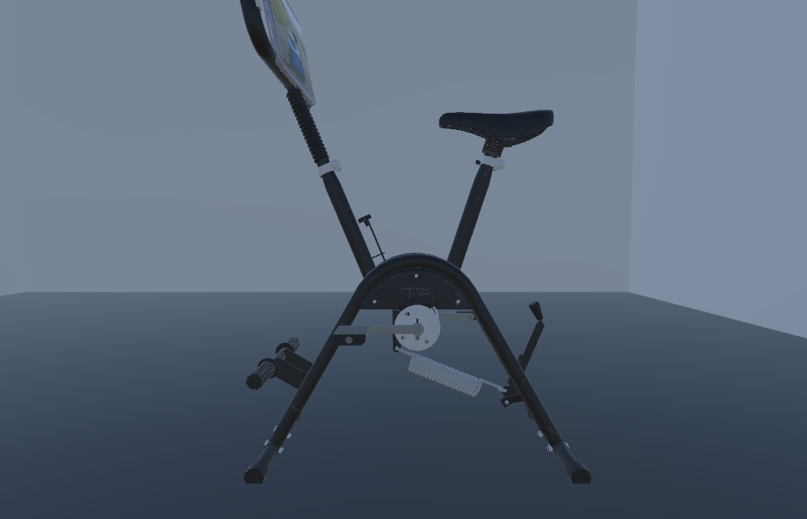
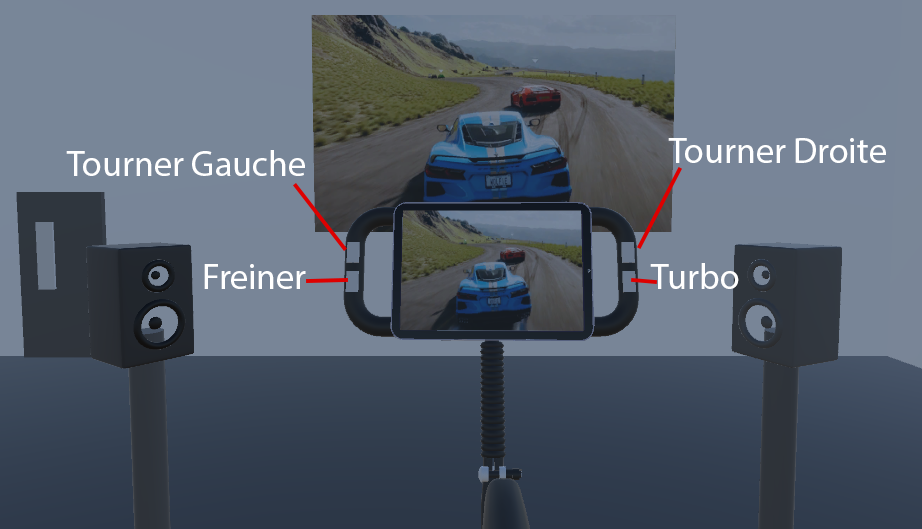
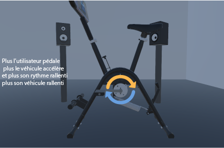
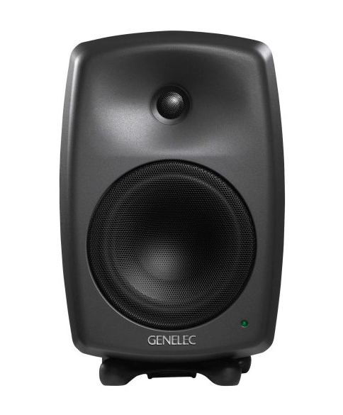
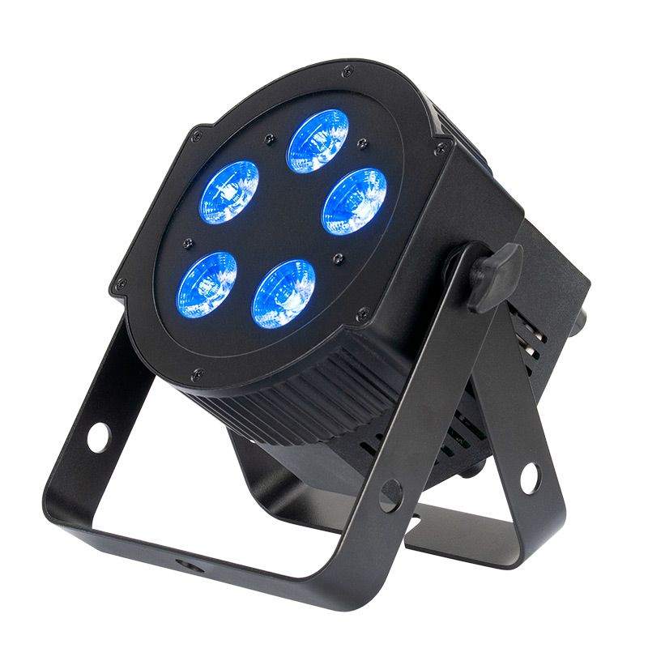
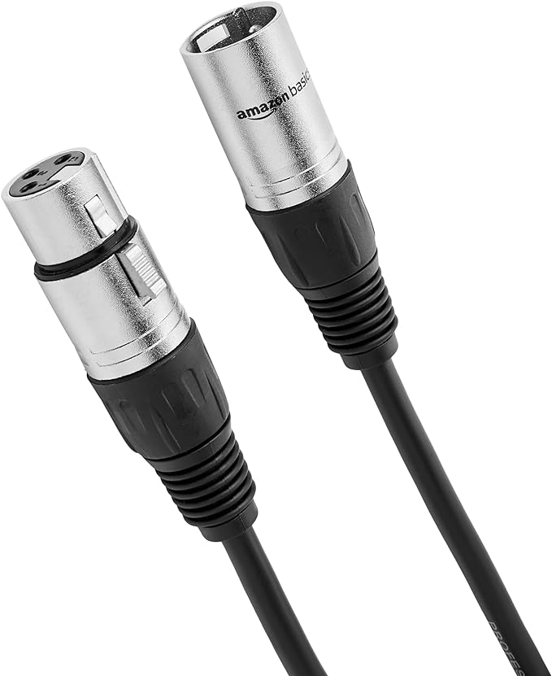
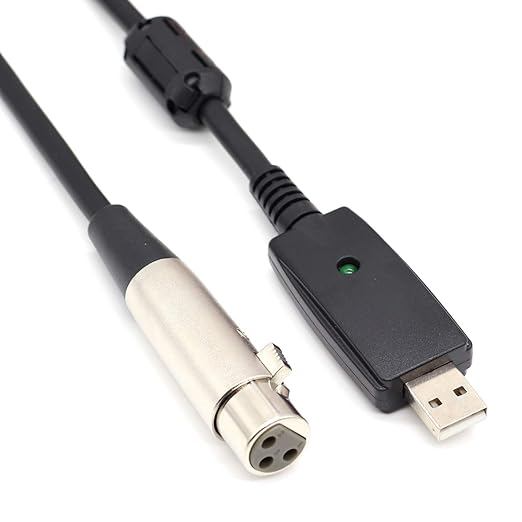
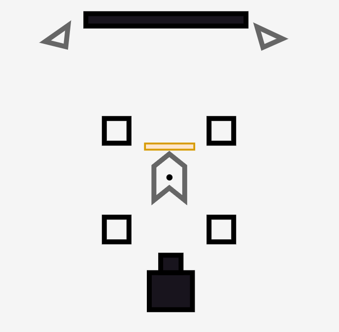

# Projet: 

## Idée
Course de véhicule style Nascar

## Objectif
Donner à l'utilisateur la motivation d'améliorer son cardio par l'intermédiaire d'un jeu intéractif

## Concept
La vitesse du vélo stationnaire définit la vitesse du véhicule, plus l’utilisateur pédale vite, plus le véhicule accélèrent et le contraire se produit si l’utilisateur ralentit ou arrête de pédaler.

On peut retrouver un frein relié à un moteur qui peut ralentir rapidement l’utilisateur et le véhicule.

Ventilateur situé a l'avant en diagonal du vélo qui prend sa vitesse en fonction de la vitesse du vélo.

Sur chaque côté des poignées se trouvent des boutons qui permettent de tourner à droite et à gauche.

Il y a un garage permettant de faire des améliorations aux véhicules et même de changer de véhicules.

Dans la course, il y a plusieurs événements aléatoires et programmés comme la conduite des autres véhicules dans la course, des accidents qui peuvent bloquer la route, des événements météorologiques comme de la pluie ou du vent, l’usure des pneus pourrait rendre le véhicule plus instable.

Collision avec autres véhicules activés.

Plusieurs pistes de course différentes demandant véhicules, pièce et conduite différente.

Il y aurait aussi un bouton à gauche permettant de changer de caméra de véhicule et un a droite permettant d’activer un turbo temporaire.
Easter Egg permettant d’avoir des power-up ou véhicule unique


## Scénario
```mermaid
flowchart TD
    A[Veille] -->|Interaction| C(Menu)
    C -->|Jouer| D[Commence le jeu]
    C -->|Consignes| E[Affiche Consignes]
    C -->|Quitter| F[Quitter l'expérience]
    F --> A
    E[Affiche Consignes]--> |Menu| C{Menu}
    D --> H[Choisir la course]
    H --> J{course}
    J --> |Recommencer| H
    J --> |Retour menu| C
    D --> I[Garage]
    I --> H
  
   

  ```

## Ambiance
https://www.youtube.com/watch?v=Ub-VoLqGcx8
## Moodboard


## Scenarimage




## Illustrations des interactions


## Technologie
- Vélo Stationnaire
- Ipad 
- Bouton 
- Haut-parleur
  
  
- Lumiere
  
  
- XLR
  
  
- XLR_USB
  
  
  
## Plantation


##  Logiciel
- Unity
- Visual Studio Community 2022
- Maya
- Touch Designer
- Arduino

## Références
- Moodboard:
- [Référence1](https://www.clubpiscine.ca/images/detailed/117/Schwinn-24-190-Velo-Stationnaire-Vertical-177710-1.jpg)
- [Référence2](https://digbza2f4g9qo.cloudfront.net/-/media/IndyCar/News/Standard/2018/04/04-22-Hairpin-Blinding-Sprays-ALA.jpg?vs=1&d=20180422T234030Z)
- [Référence3](https://encrypted-tbn3.gstatic.com/images?q=tbn:ANd9GcTo1dU64AMhI68syuVtUIBoF7c_xdoEQAiZCGAyBmDAPbQLik_V)
- [Référence4](https://assets.nintendo.com/image/upload/ar_16:9,b_auto:border,c_lpad/b_white/f_auto/q_auto/dpr_1.5/c_scale,w_400/ncom/software/switch/70010000048501/b316ae3121445fd241a09bd050fcf72c893a910d01701b283e044319a48681fd)
- [Référence5](https://m.media-amazon.com/images/I/718x3CW0NPL._AC_UF894,1000_QL80_.jpg)
- [Référence6](https://www.youtube.com/watch?v=Ub-VoLqGcx8)
- Scenarimage:
- [Garage](https://www.google.com/url?sa=i&url=https%3A%2F%2Fin.pinterest.com%2Fpin%2Fcar-parking-gui-by-haris-javed--812477589049452655%2F&psig=AOvVaw3AvRxQyjS3shZadPyjVS99&ust=1730735224096000&source=images&cd=vfe&opi=89978449&ved=0CBQQjRxqFwoTCOCi2qfBwIkDFQAAAAAdAAAAABAE)
- [Environnement](https://www.google.com/url?sa=i&url=https%3A%2F%2Fsikandarali.artstation.com%2Fprojects%2F3dGdeE&psig=AOvVaw1P5MR8IjTcrerU8F0NdmwT&ust=1730735433611000&source=images&cd=vfe&opi=89978449&ved=0CBQQjRxqFwoTCOi52orCwIkDFQAAAAAdAAAAABAE)
- [Choix carte](https://www.google.com/url?sa=i&url=https%3A%2F%2Fgraphicriver.net%2Fitem%2Fcar-racing-game-ui-kit%2F37300508&psig=AOvVaw1P5MR8IjTcrerU8F0NdmwT&ust=1730735433611000&source=images&cd=vfe&opi=89978449&ved=0CBQQjRxqFwoTCOi52orCwIkDFQAAAAAdAAAAABAT)
- [Course](https://www.google.com/url?sa=i&url=https%3A%2F%2Fus.idyllic.app%2Fquiz%2F2qiq584kuk-which-racing-game-car-best-fits-your-style&psig=AOvVaw0KmPhRodsYiLtyTW2M-G5c&ust=1730735570002000&source=images&cd=vfe&opi=89978449&ved=0CBQQjRxqFwoTCLDz88zCwIkDFQAAAAAdAAAAABAE)
- [Speaker](https://sketchfab.com/3d-models/speaker-94a91248c6de47d8a85f60fa8111c859)
- [Vélo](https://sketchfab.com/3d-models/stationary-bike-299d993f9eb94d6684562de7dca3514c)
- [Ecran](https://sketchfab.com/3d-models/interactive-display-b40454d8c4ab4fdb923fdb29bc8aa1f0)
- [Projecteur](https://sketchfab.com/3d-models/interactive-display-b40454d8c4ab4fdb923fdb29bc8aa1f0)
